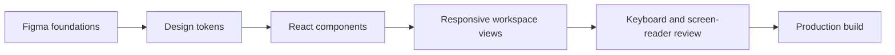

# StudioAI Control Center

StudioAI is a portfolio-grade enterprise AI operations workspace for employees, platform administrators, and operations analysts. It combines analytics, chat, model governance, trace investigation, and configuration-driven theming in one responsive React experience.

> **Figma status:** The implementation is organized for a Figma-to-code case study. A source Figma URL is not included yet because no Figma file was supplied. Add the final design link here when the working file is available.

## Product experience

- Executive operations dashboard with interactive date, application, and request-status filters
- Selectable metric cards with contextual insights and responsive request-volume data
- AI chat workspace with attachments, source metadata, feedback, and streaming simulation
- Model catalog with health, capability, usage, and an editable configuration drawer
- Trace explorer with filtering, row selection, evaluation data, and an execution timeline
- Configuration center with color mode, branding, feature flags, and live JSON preview
- Responsive navigation and layouts for desktop, tablet, and mobile

## Figma-to-code handoff markup

The following structure can be mirrored directly as pages in the Figma file:

| Figma page | Design content | React implementation |
| --- | --- | --- |
| `00 — Cover` | Project story, roles, scope, status | README and social preview |
| `01 — Foundations` | Color, type, spacing, radius, elevation, motion | CSS custom properties in `app/globals.css` |
| `02 — Components` | Buttons, fields, badges, metrics, tables, drawers | Reusable React patterns in `app/page.tsx` |
| `03 — Desktop` | 1440px dashboard, chat, models, traces, configuration | Five primary workspace views |
| `04 — Tablet` | 1024px and 768px responsive frames | Two-column and single-column breakpoints |
| `05 — Mobile` | 390px navigation drawer and stacked content | Mobile navigation, cards, forms, and chat composer |
| `06 — Prototypes` | Dashboard filtering, chat streaming, model editing, trace drill-down | Implemented interactive state and transitions |
| `07 — Accessibility` | Focus order, names, contrast, announcements, chart summaries | Keyboard and screen-reader behavior described below |
| `08 — Developer handoff` | Tokens, variants, constraints, responsive rules | CSS tokens, semantic components, and implementation notes |

### Suggested Figma annotations

Use these labels on the corresponding frames and components:

```text
Layout: Auto layout / Fill container / 24px desktop gap / 16px mobile gap
Grid: 12 columns desktop / 8 columns tablet / 4 columns mobile
Breakpoint behavior: side navigation -> modal drawer below 820px
Data table behavior: horizontal scroll with persistent column headings
Trace detail behavior: side panel desktop -> stacked panel tablet/mobile
Interaction: metric card selection updates an aria-live insight region
Motion: 180–280ms ease; disabled when prefers-reduced-motion is enabled
```



## Accessibility

The UI is designed toward WCAG 2.2 AA and treats accessibility as part of the component contract:

- A skip link moves keyboard users directly to the main workspace.
- Every interactive control uses a native button, input, select, textarea, or summary element.
- Visible focus rings are applied consistently without removing browser focus behavior.
- Dashboard filters have programmatic labels and expose expanded state.
- Selectable metrics expose `aria-pressed`; the related insight is announced through a polite live region.
- Streamed assistant responses use `aria-live="polite"` so completion can be announced without reading every token individually.
- Status badges combine text, shape, and color rather than relying on color alone.
- Charts include text alternatives summarizing the trend represented visually.
- Light and dark themes preserve semantic color roles and readable contrast.
- Responsive drawers have dialog semantics and explicit close controls.
- `prefers-reduced-motion` disables nonessential animation and transition effects.
- Dense tables remain keyboard reachable and use controlled horizontal scrolling on narrow screens.

Automated axe checks and screen-reader test evidence are recommended for the next portfolio milestone; they are not claimed as completed in this MVP.

## Design tokens

```css
--surface: #ffffff;
--text: #1d1d28;
--violet: #6558d9;
--green: #159a6b;
--amber: #db8b18;
--red: #d64c5b;
--line: #e3e4ea;
```

The configuration center demonstrates how brand, theme, density, and feature visibility can be varied without rebuilding each installation.

## Run locally

```powershell
pnpm install
pnpm dev
```

Open `http://localhost:3000`.

## Production check

```powershell
pnpm build
```

## Architecture

The first release intentionally uses realistic local data and UI simulations so the design-system, responsive, accessibility, and enterprise workflow evidence can be evaluated without cloud credentials. The next implementation stage can add FastAPI endpoints, TanStack Query, Mock Service Worker, Storybook, automated accessibility tests, and an AWS deployment.
